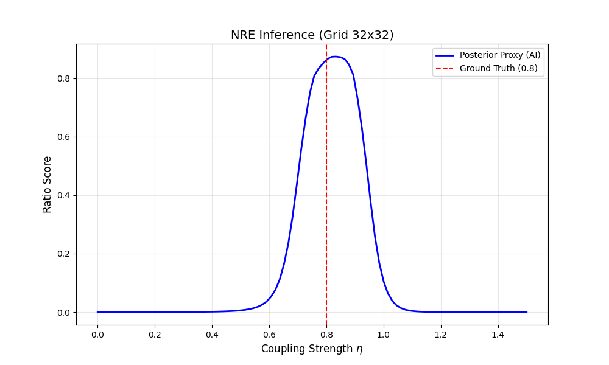
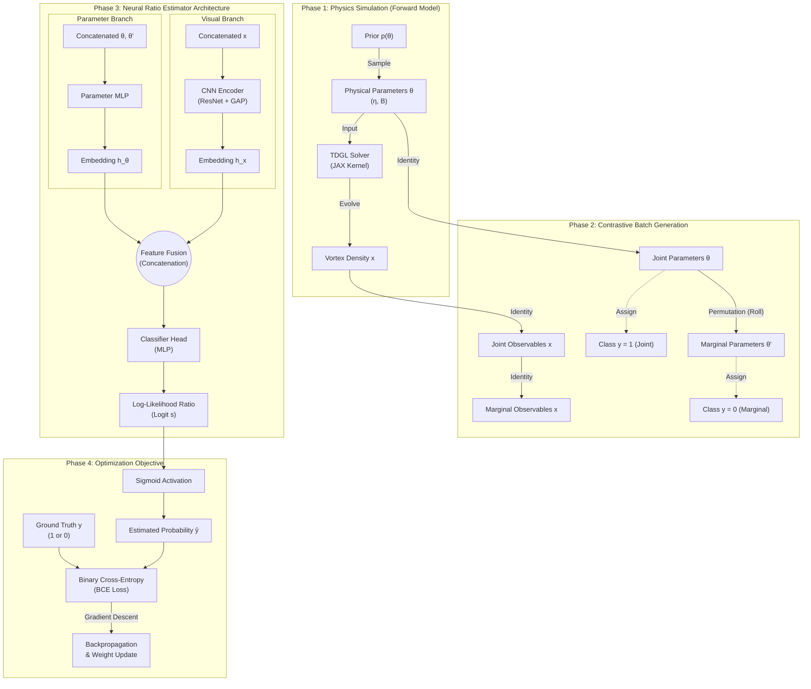

---

# GL-SBI: Ginzburg-Landau Parameter Inference via JAX & NRE

**Solving inverse problems in Type-1.5 superconductors via Differentiable Physics and NRE.**

Standard likelihood estimation for chaotic Ginzburg-Landau dynamics is mathematically intractable. This project solves this by combining a **JAX-based finite-difference solver** with **Neural Ratio Estimation (NRE)** to infer microscopic couplings ($\eta$) directly from vortex observations.

---

## Inference Demo

 The model recovers the ground truth coupling ($\eta=0.8$) with a calibrated uncertainty interval, capturing the inherent stochasticity of vortex formation.

---

## The Pipeline


**Schematic of the Simulation-Based Inference pipeline.** (a) **Data Generation:** Parameters $\theta$ are sampled from the prior and passed to the TDGL solver to generate vortex density maps $x$. (b) **Contrastive Training:** Joint pairs $(\theta, x)$ are labeled as $y=1$, while marginal pairs $(\theta', x)$ are created by permuting parameters within the batch and labeled as $y=0$. (c) **Network Architecture:** A two-tower architecture processes $x$ (via CNN) and $\theta$ (via MLP) separately. Feature vectors are concatenated and fed into a decision head to estimate the likelihood-to-evidence ratio.


---

## Core Features

- **Stateless Physics Engine**: Custom TDGL solver implemented in pure JAX. Leveraging `jax.lax.scan` and `vmap` allows for **massive parallelization** on GPUs without Python loop overhead.
    
- **Amortized Inference**: Unlike MCMC or ABC which require expensive simulations for every new observation, the NRE network is trained once and performs inference in milliseconds.
    
- **Physics-Informed Architecture**: The CNN encoder utilizes **Global Average Pooling** to enforce translational invariance, reflecting the uniform nature of the physical laws across the lattice.
    

---

## Structure

|**Module**|**File**|**Description**|
|---|---|---|
|**Solver**|[`src/gl_jax.py`](https://www.google.com/search?q=src/gl_jax.py&authuser=1)|Implements TDGL equations with Peierls substitution for gauge invariance.|
|**Training**|[`src/train_nre.py`](https://www.google.com/search?q=src/train_nre.py&authuser=1)|Main training loop implementing the contrastive loss for NRE.|
|**Model**|[`src/model.py`](https://www.google.com/search?q=src/model.py&authuser=1)|Flax definitions for the CNN Encoder and MLP Classifier.|
|**Generator**|[`src/simulator.py`](https://www.google.com/search?q=src/simulator.py&authuser=1)|Unified interface for generating data (used by both training and offline scripts).|
|**Demo**|[`demo.py`](https://www.google.com/search?q=main.py&authuser=1)|An interactive `matplotlib` tool to visualize vortex dynamics in real-time.|

---

## Quick Start

### 1. Prerequisites

Requires Python 3.8+ and JAX.

Bash

```
# Install JAX (Default CPU version)
# For GPU support, please refer to JAX documentation
pip install --upgrade "jax[cpu]"

# Install the rest
pip install -r requirements.txt
```

### 2. Run the Physics Solver

Verify that the JAX solver compiles and runs correctly.

Bash

```
python -m src.gl_jax
# Expected: Done. Final shape: (64, 64)
```

### 3. Interactive Visualization

Launch the virtual lab to explore how $\eta$ and $B$ affect vortex clustering.

Bash

```
python demo.py
```

### 4. Train the Model

Run the training pipeline. This script will:

1. Generate data on-the-fly using `vmap`.
    
2. Train the NRE classifier.
    
3. Output an inference plot (`inference_result.png`).
    

Bash

```
python -m src.train_nre
```

---
