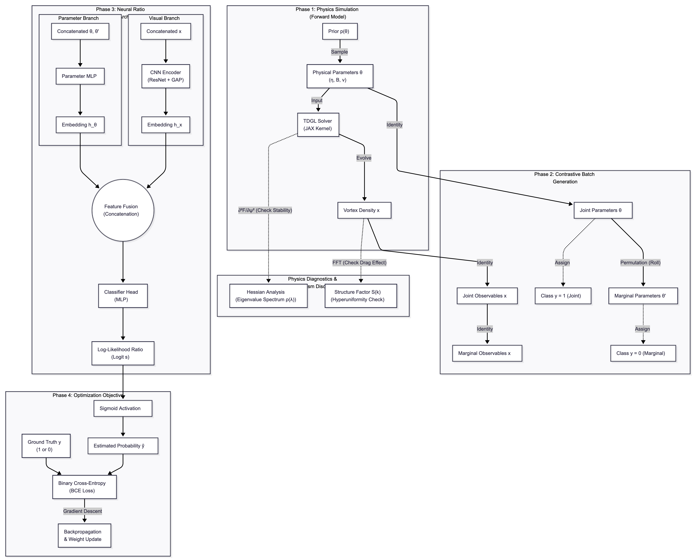
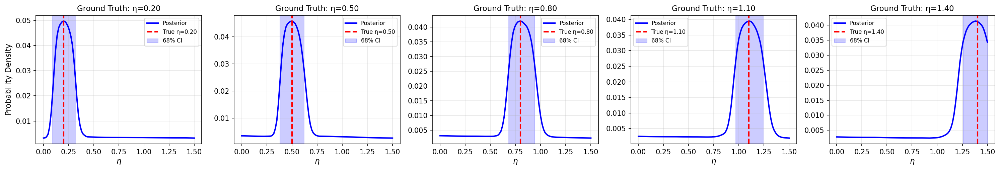

# Simulation-Based Inference of Ginzburg-Landau Parameters

[](LINK_TO_ARXIV)
[](https://opensource.org/licenses/MIT)


**Inferring microscopic couplings in Type-1.5 superconductors using Neural Ratio Estimation (NRE).**

---

## Key Contributions

* **Differentiable TDGL Solver:** A JAX-based, gauge-invariant Time-Dependent Ginzburg-Landau solver tailored for multi-component systems.
* **Glassy Landscape Quantification:** Analysis of the Hessian spectrum to demonstrate the "soft mode" proliferation that hinders traditional MCMC.
* **Likelihood-Free Inference:** Uses Neural Ratio Estimation (NRE) to bypass the intractable likelihood of disordered vortex matter.
* **Physics Discovery:** Identifies the transient suppression of structure factor $S(k)$ as the dynamical fingerprint of Andreev-Bashkin drag.

---

## Overview

### 1. The Challenge: A Glassy Landscape
Inferring parameters from vortex configurations is ill-posed due to the proliferation of "soft modes" (near-zero eigenvalues in the Hessian).


*Fig 1: The density of states $\rho(\lambda)$ reveals flat directions in the energy landscape.*

### 2. The Solution: Neural Ratio Estimation
We treat the solver as a stochastic simulator and train a classifier to approximate the likelihood-to-evidence ratio $r(x, \theta)$.


*Fig 2: Pipeline integrating the TDGL solver with the contrastive NRE training loop.*

### 3. Results: Accurate Recovery
The framework reliably recovers the Josephson coupling $\eta$ with calibrated uncertainty (verified via Simulation-Based Calibration).


*Fig 3: Posterior distributions for varying ground-truth coupling strengths.*

---

## 🛠️ Usage

### Installation
```bash
git clone [https://github.com/JSKao/gl-sbi.git](https://github.com/JSKao/gl-sbi.git)
cd gl-sbi
pip install -r requirements.txt
````

### Reproducing Results

**1. Generate Data (TDGL Simulation)**
Runs the JAX solver to create the vortex dataset.

```bash
python -m src.generate_data --config configs/default.yaml
```

**2. Train NRE Model**
Trains the ratio estimator using the contrastive loss.

```bash
python -m src.train_offline
```

**3. Evaluation & Diagnostics**
Generates posterior plots, coverage (SBC) analysis, and $S(k)$ drag diagnostics.

```bash
python -m src.run_comprehensive_tests
```

> **Note:** Experimental noise models (STM/TEM) are available in `src/experimental_noise.py`.

-----

